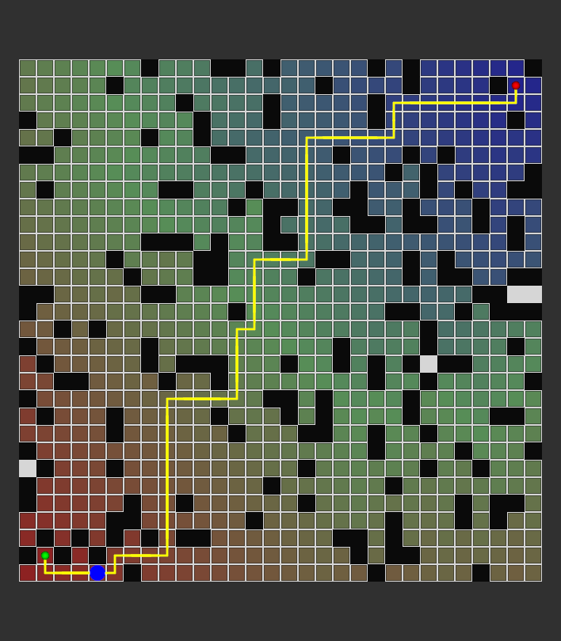

# ARP Assignment 1 — Backward Value Iteration in ROS 2

A robot on a 30 × 30 grid with 20% random obstacles. **Backward Value
Iteration (BVI)** computes the optimal cost-to-go from every reachable
cell to the goal. The robot then follows the resulting optimal path,
and everything is visualized in **RViz2**.

- **Robot moves:** N, S, E, W (one cell per move, cost 1 each)
- **Start:** `(1, 1)`, **Goal:** `(28, 28)`
- **Platform:** ROS 2 Jazzy, Python 3.12 (Ubuntu 24.04 / Linux Mint 22)



---

## Results

| Quantity | Value |
|---|---|
| Grid size | 30 × 30 = 900 cells |
| Obstacles | 180 (20%), fixed random seed `42` |
| Free cells / reachable from goal | 720 / 716 |
| BVI sweeps until convergence | 57 |
| Cost-to-go at start | 56 |
| Optimal path length | 56 moves |
| First optimal action from start | S |

The cost-to-go values were checked against an independent
breadth-first search from the goal and match exactly on every cell.

---

## How each assignment task is covered

| # | Task | Where |
|---|---|---|
| 1 | Install ROS 2, build the map, robot at start | `ros2 launch arp_assignment bvi_demo.launch.py`: map on `/map`, robot shown at the start for the first 5 s |
| 2 | Visualize cost-to-go values | RViz2 heatmap on `/cost_to_go` (blue = near goal, red = far). The exact value of every cell is in `visualize_bvi.py` |
| 3 | Show the optimal path | Yellow line in RViz2 on `/optimal_path`. Also `visualize_path.py` |
| 4 | RViz2 robot navigation | Blue robot moves one cell every 2 s along the path, with `/robot_pose` and the `map → base_link` TF |

---

## Quick start (demo)

```bash
# 1. Build (from the workspace root, not from ~)
cd ~/arp_ws
source /opt/ros/jazzy/setup.bash
colcon build --packages-select arp_assignment
source install/setup.bash

# 2. Run the node and RViz2 together
ros2 launch arp_assignment bvi_demo.launch.py
```

RViz2 opens already set up: fixed frame `map`, top-down view, and every
display added. The robot waits at the start for 5 s and then follows
the path to the goal. Press **Ctrl+C** to stop both.

Launch arguments:

| Argument | Default | Meaning |
|---|---|---|
| `start_delay` | `5.0` | Seconds the robot stays at the start before moving |
| `step_period` | `2.0` | Seconds per move (the whole path takes 56 × this) |

```bash
ros2 launch arp_assignment bvi_demo.launch.py start_delay:=10.0 step_period:=1.0
```

If you zoom or pan in RViz2 by accident, click **Reset** (bottom left)
to return to the saved view.

### What you see in RViz2

| Display | Topic | Appearance |
|---|---|---|
| Map | `/map` | Black = obstacle. Light grey = free but unreachable (walled in), so no cost-to-go |
| Cost-to-go | `/cost_to_go` | Blue (low cost, near goal) → green → red (high cost) |
| Optimal Path | `/optimal_path` | Yellow line |
| Start / Goal | `/start_goal_markers` | Green sphere = start, red sphere = goal |
| Robot | `/robot_marker` | Blue cylinder |
| Robot Pose | `/robot_pose` | Arrow (disabled by default) |

---

## Cost-to-go and path plots (matplotlib)

These scripts run the same algorithm outside ROS. Run them from the
module folder:

```bash
cd ~/arp_ws/src/arp_assignment/arp_assignment

python3 test_bvi.py        # prints iterations, cost-to-go at start, first action
python3 visualize_bvi.py   # heatmap with the cost-to-go number written in every cell
python3 visualize_path.py  # map with the optimal path drawn from start to goal
```

Requires `python3-matplotlib` (`sudo apt install python3-matplotlib`).

---

## Algorithm

**State space.** Each free cell `(x, y)` is a state. `grid[y, x] == 1`
marks an obstacle.

**Backward Value Iteration** (`value_iteration.py`):

1. Initialize `V(goal) = 0` and `V(s) = ∞` for every other state.
2. Sweep over all free states. For each one, apply the Bellman update
   over the valid neighbours `s'` (inside the grid and not an obstacle):

   ```
   V(s) = min over a ∈ {N, S, E, W} of [ 1 + V(s') ]
   π(s) = the action a that gives the minimum
   ```

3. Repeat until a full sweep changes no value. That takes 57 sweeps
   here.

Values spread outward from the goal, so after convergence `V(s)` is
the minimum number of moves from `s` to the goal. Cells that cannot
reach the goal keep `V = ∞` and are not drawn.

**Path extraction** (`path_planner.py`) starts at the start cell and
follows `π(s)` until it reaches the goal. Because `V` is optimal, this
path is a shortest path, and its length equals `V(start)`.

```
GridMap ──► BackwardValueIteration ──► V (cost-to-go) ──► /cost_to_go
                                   └─► π (policy) ──► PathPlanner ──► /optimal_path ──► robot motion
```

---

## ROS 2 interface

**Node:** `bvi_navigation` (executable `navigation_node`)

On startup the node builds the map, runs BVI and extracts the path.
After that, a timer publishes everything every `step_period` seconds
and moves the robot one cell along the path.

| Topic | Type | Notes |
|---|---|---|
| `/map` | `nav_msgs/OccupancyGrid` | 1 m per cell, origin (0, 0). QoS: transient local |
| `/cost_to_go` | `visualization_msgs/Marker` | `CUBE_LIST`, one coloured cube per reachable cell |
| `/optimal_path` | `nav_msgs/Path` | Cell centres from start to goal |
| `/robot_pose` | `geometry_msgs/PoseStamped` | Current robot cell centre |
| `/robot_marker` | `visualization_msgs/Marker` | Robot cylinder |
| `/start_goal_markers` | `visualization_msgs/Marker` | Two spheres (ids 0 and 1) |

**TF:** `map → base_link` at the robot position.

**Parameters:** `start_delay` (double, 5.0) and `step_period`
(double, 2.0).

Useful checks while it runs:

```bash
ros2 node list                               # /bvi_navigation, /rviz2
ros2 topic list
ros2 topic echo /robot_pose --field pose.position
ros2 run tf2_ros tf2_echo map base_link
```

---

## Package layout

```
arp_assignment/
├── package.xml, setup.py, setup.cfg
├── launch/
│   └── bvi_demo.launch.py     # node + RViz2 with saved config
├── rviz/
│   └── bvi_demo.rviz          # display and view configuration
└── arp_assignment/
    ├── map_generator.py       # GridMap: 30×30 grid, 20% obstacles, start/goal
    ├── value_iteration.py     # BackwardValueIteration: V and π
    ├── path_planner.py        # PathPlanner: follow π from start to goal
    ├── navigation_node.py     # ROS 2 node: publishers, TF, robot motion
    ├── test_bvi.py            # standalone check (no ROS)
    ├── visualize_bvi.py       # matplotlib cost-to-go plot with values
    └── visualize_path.py      # matplotlib optimal-path plot
```

### Changing the map, start or goal

All three are set in `GridMap` (`map_generator.py`):

- `seed=42`: change it for a different obstacle layout
- `obstacle_ratio=0.20`
- `self.start = (1, 1)` and `self.goal = (28, 28)`: keep both inside
  the grid. Obstacles are never placed on them.

Rebuild afterwards with `colcon build --packages-select arp_assignment`.

---

## Running without the launch file

```bash
# Terminal 1
source /opt/ros/jazzy/setup.bash && source ~/arp_ws/install/setup.bash
ros2 run arp_assignment navigation_node

# Terminal 2
source /opt/ros/jazzy/setup.bash && source ~/arp_ws/install/setup.bash
rviz2 -d ~/arp_ws/install/arp_assignment/share/arp_assignment/rviz/bvi_demo.rviz
```

If you open plain `rviz2` without a config, set **Fixed Frame** to `map`
and **View** to `TopDownOrtho`. Then add `/map` (Map), `/optimal_path`
(Path), and `/cost_to_go`, `/start_goal_markers` and `/robot_marker`
(Marker).

---

## Troubleshooting

| Problem | Fix |
|---|---|
| `ros2: command not found` | `source /opt/ros/jazzy/setup.bash` |
| `Package 'arp_assignment' not found` | Build, then `source ~/arp_ws/install/setup.bash` in **every** new terminal |
| `colcon build` picks up unrelated projects | Run it from `~/arp_ws`, not from `~` |
| Code changes have no effect | Rebuild. If that doesn't help, `rm -rf build install log` and build again |
| RViz2 shows the map rotated or zoomed oddly | Click **Reset** in the Views panel |
| `ModuleNotFoundError: map_generator` when running a script | Run the matplotlib scripts from `src/arp_assignment/arp_assignment/` |
